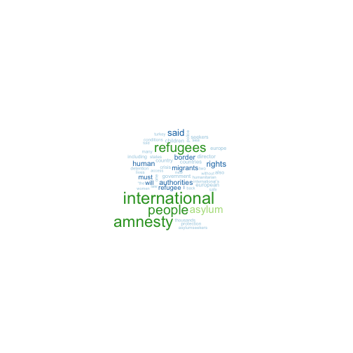
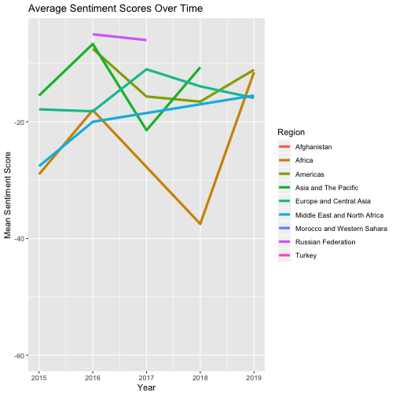
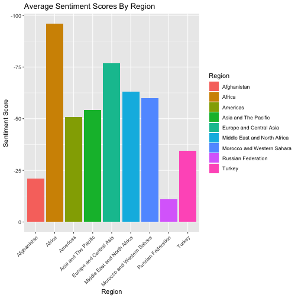
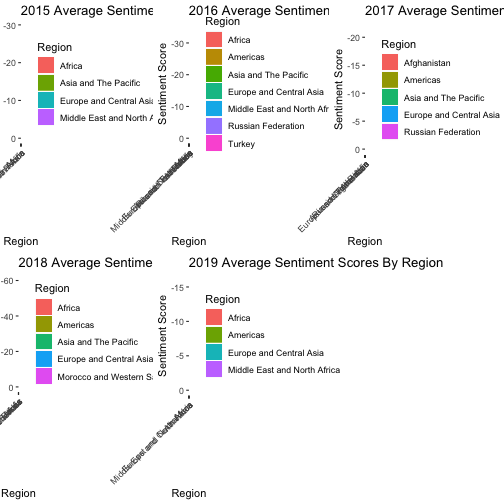

Is Asylum International Biased?
========================================================
author: Casey Mallon
date: 12/10/19
autosize: true

Why does it matter? 
========================================================
Recent migration crises.<br />
Recent conservative political figures questioning
the authority of NGOs

Data Collection
========================================================


```r
base<- "https://www.amnesty.org/en/latest/news/?contentType=2561&issue=1613&sort=date&p="
page=c(1:11)%>%as.character()
webpages<- str_c(base, page)

#gets all the URLs from the search results
all_URLs<- function(i){
  URLs<- read_html(i)%>%
    html_nodes(".search-item__link")%>%
    html_attr("href")%>%
    as.character()
  results<- paste0("https://www.amnesty.org", URLs)
  return(results)
}
#all of the news articles
ALL_URLS<- map(webpages, all_URLs)%>%
  unlist()

#function to get the region, title, date, and text of each article
scrape_text <- function(url){
  webpage<- read_html(url)
  text <- html_nodes(webpage, ".wysiwyg") %>%
    html_text()
  title<- html_nodes(webpage,".heading--main")%>%
    html_text()
  region<-html_nodes(webpage, ".tags__item--bold--sm+ .tags__item--discrete .tags__link--discrete--md")%>%
    html_text()
  date<- html_nodes(webpage, "time")%>%
    html_text()
  all_info<- data.frame(date=ifelse(length(date)==0, NA, date),
                        region=ifelse(length(region)==0,NA, region),
                        title= ifelse(length(title)==0,NA,title),
                        text= ifelse(length(text)==0,NA,text))
  return(all_info)
}
#Need to include the ifelse part in the data.frame in case articles aren't formatted in the same way
#Apparently its too much money to have uniform structure
#some of the articles aren't actually formatted using the same nodes, 
#some titles use nodes that mean different things on different pages

#Making a giant data frame
Amenesty_International_Asylum<- map_dfr(ALL_URLS,scrape_text)
```

Tidying the Data
========================================================


```r
#filter out all the NAs
Asylum_Full<- Asylum%>%
  filter(!is.na(region), !is.na(date), !is.na(text), !is.na(title))%>%
  subset(select=-c(X))

#filter out all the incorrect titles
#these are titles like "Amnesty's Experts"
#the reason is that these pages are coded differently than 
Asylum_Title<-Asylum_Full%>%
  filter(title!="Amnesty's experts")
#number of observations dropped from 159 to 132

#This gives everything a nice name and simplifies the date to just the year
Asylum_Tidy<-Asylum_Title%>%
  rename(Date=date, Region=region, Title=title, Text=text)%>%
  mutate(Date=as.numeric(str_extract(Date,"\\d{4}")))


#Next I need to manually collapse the regions
#For some reason, Amnesty International doesn't stick to regions
#In a few cases they list specific countries
#I'll continue to keep the Turkey, Afghanistan, and Russia left as separate entities
#Miscoding on the original site for two articles, marked the regions as Refugees and Detention
#Recoded to Europe

Region_clean<- recode(Asylum_Tidy$Region,"Burundi"="Africa", "Congo"="Africa", "Kenya"="Africa", "Eritrea"="Africa",
                         "Libya"="Middle East and North Africa","Middle East and North Africa " = "Middle East and North Africa",
                         "Hungary"= "Europe and Central Asia", "Spain"="Europe and Central Asia", 
                         "France"="Europe and Central Asia","Greece"="Europe and Central Asia","Italy"="Europe and Central Asia",
                         "Ecuador"="Americas","Venezuela"="Americas", "Cuba"="Americas",
                         "Nauru" = "Asia and The Pacific", "Australia"="Asia and The Pacific", "Malaysia"="Asia and The Pacific",
                         "Refugees"="Europe and Central Asia","Detention"="Europe and Central Asia",
                          "United States of America"="Americas")

Asylum_Tidy$Region_clean<- as.character(Region_clean)

#Removing the old Region 
Asylum_Tidyer<- Asylum_Tidy%>%
  subset(select= -c(Region))%>%
  rename("Region"="Region_clean")%>%
 subset(select=c(1,4,2,3))
```

Text Analysis
========================================================


```r
##Pre-Processing
Asylum<-Corpus(VectorSource(Asylum.dat$Text))
Asylum_dtm <- DocumentTermMatrix(Asylum,
                          control = list(stopwords = TRUE,
                                         tolower = TRUE,
                                         removeNumbers = TRUE,
                                         removePunctuation = TRUE))
Asylum_dtm<-as.data.frame(as.matrix(Asylum_dtm))

#Using bing lexicon for simple binary positive v. negative categorization
Asylum_sentiments<- get_sentiments("bing")

Asylum_sentiments$score<-ifelse(Asylum_sentiments$sentiment=="positive",1,-1)


#Score each article 
Words<- data.frame(word=colnames(Asylum_dtm))
Words<-merge(Words,Asylum_sentiments,all.x=T)
Words$score[is.na(Words$score)]<-0
Scores<- as.matrix(Asylum_dtm)%*%Words$score

##Edit the dataframe
Asylum.dat$Scores= Scores
Asylum.dat<- Asylum.dat%>%
  subset(select=-c(X))
```

Which words are the most frequent?
========================================================


Average Sentiment Scores Over Time
========================================================


Average Sentiment Scores by Region
========================================================


Average Sentiments Scores by Region per Year
========================================================


